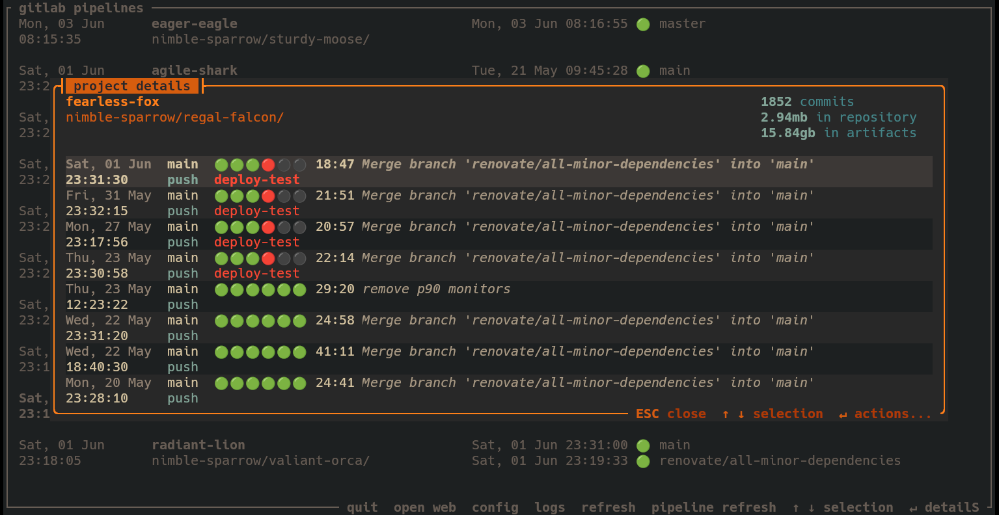
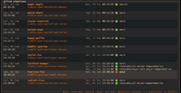
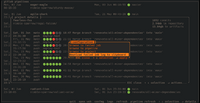

## glim



[](screenshots/gitlab_projects.png)
[](screenshots/pipeline_actions.png)

A terminal user interface (TUI) for monitoring GitLab CI/CD pipelines and projects.
Built with [ratatui](https://ratatui.rs/).

### Prerequisites
- a terminal emulator with support for 24-bit color, e.g. [kitty](https://sw.kovidgoyal.net/kitty/)
- a GitLab personal access token (PAT) with `read_api` scope
- `libssl-dev` installed on your system

### Building
```
cargo build --release 
```

### Running

`glim` requires a GitLab personal access token (PAT) to authenticate with the GitLab API, which is
recorded in a configuration file. `glim` starts with no arguments, and prompts for the PAT and
gitlab server URL. 

```
$ glim -h
A TUI for monitoring GitLab CI/CD pipelines and projects

Usage: glim [OPTIONS]

Options:
  -c, --config <FILE>      Alternate path to the configuration file
  -p, --print-config-path  Print the path to the configuration file and exit
  -h, --help               Print help
  -V, --version            Print version
```

#### Multiple GitLab servers

There is currently no support for multiple GitLab servers in the configuration file. The interim
solution is to use the `--config` flag to specify a different configuration file, e.g. 
`glim --config glim-corporate.toml` or `glim --config glim-personal.toml`.
